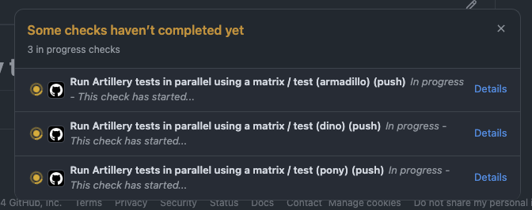
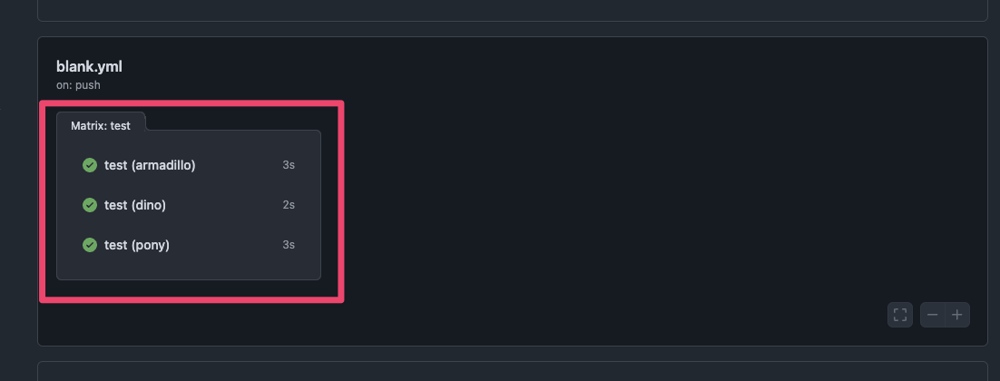

# Running Artillery tests in parallel with GitHub Actions

This is an example showing how you can run multiple Artillery load tests in parallel on GitHub Actions with the [matrix strategy](https://docs.github.com/en/actions/writing-workflows/choosing-what-your-workflow-does/running-variations-of-jobs-in-a-workflow).

## Code structure

1. The main Artillery configuration file is in [`config.yml`](./config.yml). This defines our target and load phases. In a more realistic test it would also include plugin configuration, load custom JS/TS code, etc.
2. We have 3 different VU scenarios defined in files under `scenarios`, e.g. [`scenarios/armadillo.yml`](./scenarios/armadillo.yml).

Our goal is to run 3 Artillery load tests in parallel, using the config file with each individual scenario file.

## GitHub Actions workflow

Our workflow definition is in [`.github/workflows/run-artillery-tests.yml`](./.github/workflows/run-artillery-tests.yml).

To run 3 Artillery load tests in parallel we define a matrix containing the names of our scenarios:

```yaml
matrix:
  # Create a scenario_name variable in this job that will be used to
  # run an Artillery test for that scenario
  scenario_name:
    - armadillo
    - dino
    - pony
```

That creates a `scenario_name` variable in the workflow which we can use to run an Artillery load test as a GitHub Actions job:

```yaml
- name: Run Artillery tests in parallel
  run: |
    artillery run scenarios/${{matrix.scenario_name}}.yml --config config.yml
```

GitHub Actions will automatically create a job for each option we define in the matrix. The end result looks like this:

3 jobs running in parallel, one for each scenario:



The workflow view in the **Actions** tab:



## Questions

If you have a question or run into any issues, let us know via [Discussions](https://github.com/artilleryio/artillery/discussions).
